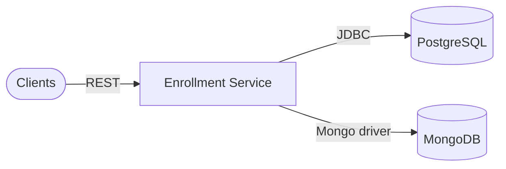

# Architecture

## Clients

Student portals, admins, and other services invoking enrollment flows.

### Components

- SPA / admin UI
- Schedule, curriculum, student services (HTTP)

### Responsibilities

- Submit enrollments, query state, trigger preloads

### Technologies

- HTTPS
- JWT (when secured)

## Application runtime

Enrollment Service Spring Boot application.

### Components

- Enrollment command & finder controllers
- Student enrollment controller
- Preload controllers (student, subject, schedule, grade)
- Domain services, repositories

### Responsibilities

- Registration workflows bridging students and class groups

### Technologies

- Spring Web
- Spring Data JPA
- Spring Data MongoDB

## Persistence

Transactional store plus document store for job state.

### Components

- PostgreSQL enrollment_db
- MongoDB (preload / projection collections)
- Eureka + Config Server clients

### Responsibilities

- ACID enrollments; durable preload status and blobs

### Technologies

- PostgreSQL 16
- MongoDB 7
- Spring Cloud Netflix Eureka
- Spring Cloud Config

## Design patterns

| Pattern | Category | Description |
| --- | --- | --- |
| DB Database per service | Microservices | enrollment_db schema is owned here; no foreign keys to other services' tables. |
| DOC Polyglot persistence | Data | OLTP in Postgres; Mongo for flexible preload documents and progress tracking. |

## Scalability strategies

- **Scale stateless API tier** — Horizontal replicas with sticky-less load balancing.
- **Isolate bulk preload load** — Throttle or queue heavy preloads so OLTP enrollment latency stays predictable.

## Security strategies

- **Student vs admin routes** — Different route families for self-service vs operator preload; enforce with Spring Security + gateway.
- **Secrets for both datastores** — RDS/Atlas credentials via environment or secret manager — never committed.

## Cache strategies

| Name | TTL | Coverage | Description |
| --- | --- | --- | --- |
| None by default | n/a | Future | Consider Redis for idempotency keys or rate limits on enrollment spikes. |

## Architecture highlights

### EU Discovery + external config

Eureka registration; YAML from config-data/enrollment-service.yml.

### JOB Bulk operation APIs

Preload controllers pattern for operational imports.

## Architecture diagram

### Legend

| Type | Label |
| --- | --- |
| service | Service |
| database | SQL |
| database | Mongo |

### Nodes

| ID | Label | Type | Status |
| --- | --- | --- | --- |
| client | Clients | client | healthy |
| enrollment | Enrollment Service | service | healthy |
| pg | PostgreSQL | database | healthy |
| mongo | MongoDB | database | healthy |

### Connections

| From | To | Label | Protocol |
| --- | --- | --- | --- |
| client | enrollment | REST | HTTP |
| enrollment | pg | JDBC | TCP |
| enrollment | mongo | Mongo driver | TCP |

### Mermaid overview

## Data flow

### Request flow

1. **Authorize request** — Gateway validates JWT/session before hitting enrollment APIs.
2. **Execute use case** — Command or student controller validates business rules (capacity, lock date, duplicates).
3. **Persist** — Transactional writes to Postgres; preload metadata to Mongo when applicable.

### Event flow

1. **Preload lifecycle** — POST /preload starts work; GET /preload/{id}/status polls Mongo-backed state.
2. **Downstream visibility** — Schedule/grade services read enrollment facts via HTTP or shared events (if added later).

## Technical decisions

### Postgres + Mongo in one service

**Problem:** Enrollments need ACID; bulk preload status needs flexible schema.

**Solution:** JPA for enrollments; Mongo templates/repositories for process documents.

**Outcome:** Operators get progress APIs without bloating relational tables.

#### Alternatives considered

- Single Postgres JSONB column for job state
- External workflow engine (Temporal, Camunda)

## Additional notes

# Architecture

Matches **`ProjectArchitectureModel`** in `docs-schema.ts`.

## Watch items

- **Consistency:** document which reads are **Postgres-authoritative** vs **Mongo** (preload only).  
- **Path normalization:** several mappings omit a leading `/` — enforce **`/v1/api/...`** externally.  
- **migrate vs ddl-auto:** prefer **Flyway/Liquibase** on Postgres outside dev.  
- **Mongo indexes** on preload query fields (`processId`, TTL if ephemeral jobs).

