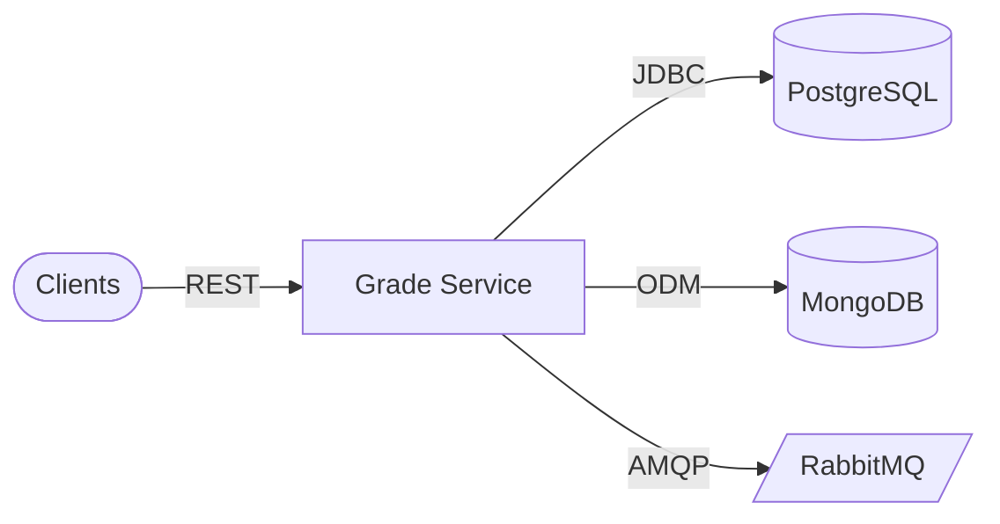

# Architecture

## Edge & clients

Admin tools, student and teacher apps, and peer services call Grade Service over HTTPS.

### Components

- Authenticated clients (JWT)
- Internal microservice callers

### Responsibilities

- Propagate bearer tokens issued by account-service

### Technologies

- HTTPS
- JWT

## Application runtime

Grade Service Spring Boot process

### Components

- Grade query/command controllers
- Group and teacher grading controllers
- Academic history controllers
- Security, validation, rate limiting

### Responsibilities

- Grades, groups, teacher workflows, student read models

### Technologies

- Spring Web
- Spring Data JPA
- Spring Data MongoDB
- Spring AMQP

## Data & messaging

PostgreSQL grade_db, MongoDB grade_db, RabbitMQ

### Components

- Relational grades and relationships
- Document projections where used
- AMQP exchanges/queues for history refresh

### Responsibilities

- Durable grades; async integration

### Technologies

- PostgreSQL 16
- MongoDB 7
- RabbitMQ 3

## Design patterns

| Pattern | Category | Description |
| --- | --- | --- |
| DB Database per service | Microservices | grade_db (SQL + document URI) owned by this service; no cross-service table sharing. |
| API CQSP-style splits | API | Separate query and command controllers for grades reduce accidental coupling on writes. |

## Scalability strategies

- **Stateless HTTP tier** — Scale Boot instances; JWT carries identity; no server session affinity required.
- **Tune brokers and DB pools** — Rabbit consumers and JDBC pool sizes scale with traffic separately.

## Security strategies

- **JWT validation** — Resource server validates tokens; teacher/student routes derive account from the JWT.
- **Role-gated admin routes** — Academic history admin endpoint uses `@PreAuthorize("hasRole('ADMIN')")`.

## Cache strategies

| Name | TTL | Coverage | Description |
| --- | --- | --- | --- |
| None by default | n/a | Future | Add Redis or CDN if read-heavy catalog or history endpoints need it. |

## Architecture highlights

### EU Spring Cloud discovery

Eureka client registration from config.

### CFG Centralized configuration

config-data/grade-service.yml via Config Server.

## Architecture diagram

### Legend

| Type | Label |
| --- | --- |
| service | Microservice |
| database | SQL / document |
| queue | Broker |

### Nodes

| ID | Label | Type | Status |
| --- | --- | --- | --- |
| client | Clients | client | healthy |
| grade_service | Grade Service | service | healthy |
| postgres | PostgreSQL | database | healthy |
| mongodb | MongoDB | database | healthy |
| rabbit | RabbitMQ | queue | healthy |

### Connections

| From | To | Label | Protocol |
| --- | --- | --- | --- |
| client | grade_service | REST | HTTP |
| grade_service | postgres | JDBC | SQL |
| grade_service | mongodb | ODM | Mongo |
| grade_service | rabbit | AMQP | AMQP |

### Mermaid overview

## Data flow

### Request flow

1. **Authenticate** — Client presents JWT from account-service where required.
2. **Invoke API** — Controller validates input and delegates to domain services.
3. **Persist / project** — Writes hit PostgreSQL; Mongo or messaging may update read models asynchronously.

### Event flow

1. **Domain signal** — Grade or history changes may publish or consume AMQP messages.
2. **Projection refresh** — Listeners update academic history or related aggregates.

## Technical decisions

### Dual store

**Problem:** Some reads suit documents while grades stay relational.

**Solution:** PostgreSQL for grades; Mongo URI configured for grade_db projections.

**Outcome:** Flexibility without giving up transactional grade rows.

#### Alternatives considered

- Postgres-only JSON columns for all projections
- Event sourcing with separate read stack

### Netflix Eureka + Config

**Problem:** Platform already standardizes on Spring Cloud Netflix.

**Solution:** Reuse Eureka and Config Server for discovery and YAML.

**Outcome:** Operational consistency across college microservices.

#### Alternatives considered

- Kubernetes service DNS only
- Consul

## Additional notes

# Architecture

**Grade Service** is a Spring Boot 3.3 module with **Eureka**, **Config Server**, **PostgreSQL**, **MongoDB**, and **RabbitMQ** as in Compose.

## Watch items

- **`AcademicHistoryController`** maps to `v1/api/academic-histories` (no leading `/`). Treat externally as **`/v1/api/academic-histories`** after gateway normalization.
- **Ownership of read models:** clarify which store is authoritative per query path when troubleshooting discrepancies between SQL and Mongo-backed views.

