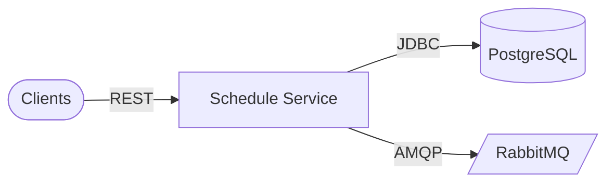

# Architecture

## Clients

Admin scheduling tools, enrollment service, and internal consumers.

### Components

- Back-office UI
- Enrollment and grade services

### Responsibilities

- Create and query offerings; mutate rosters

### Technologies

- HTTPS
- JWT when secured

## Application runtime

Schedule Service Spring Boot application.

### Components

- GroupCreationController
- GroupFinderController
- GroupUpdateController
- GroupDeletionController
- Domain services and JPA

### Responsibilities

- Operational timetable and capacity management

### Technologies

- Spring Web
- Spring Data JPA
- Spring AMQP

## Data & messaging

Relational state plus broker for integration.

### Components

- PostgreSQL schedule_db
- RabbitMQ
- Eureka + Config Server clients

### Responsibilities

- Durable groups; publish consumption-friendly events

### Technologies

- PostgreSQL 16
- RabbitMQ 3
- Spring Cloud Netflix Eureka
- Spring Cloud Config

## Design patterns

| Pattern | Category | Description |
| --- | --- | --- |
| DB Database per service | Microservices | schedule_db contains scheduling aggregates only. |
| CQRS Command/query split | API | /v1/api/groups vs /v1/api/finder/groups separates writes from read-optimized queries. |

## Scalability strategies

- **Stateless API tier** — Scale replicas; offload heavy reporting with read replicas or cached projections if needed.
- **Broker decoupling** — RabbitMQ absorbs peak fan-out to peers without synchronous chains.

## Security strategies

- **Role-aware mutations** — Restrict group mutations to operators; student-facing traffic should not hit dangerous routes.
- **Least-privilege DB and broker creds** — Separate credentials per environment.

## Cache strategies

| Name | TTL | Coverage | Description |
| --- | --- | --- | --- |
| Optional catalog cache | TBD | Future | Cache hot finder responses (e.g. current term slice) if metrics justify it. |

## Architecture highlights

### EU Eureka + Config

Discovery and externalized YAML from config-data/schedule-service.yml.

### MQ AMQP integration

Spring AMQP templates/listeners as implemented in the module.

## Architecture diagram

### Legend

| Type | Label |
| --- | --- |
| service | Microservice |
| database | PostgreSQL |
| queue | RabbitMQ |

### Nodes

| ID | Label | Type | Status |
| --- | --- | --- | --- |
| client | Clients | client | healthy |
| schedule | Schedule Service | service | healthy |
| pg | PostgreSQL | database | healthy |
| mq | RabbitMQ | queue | healthy |

### Connections

| From | To | Label | Protocol |
| --- | --- | --- | --- |
| client | schedule | REST | HTTP |
| schedule | pg | JDBC | TCP |
| schedule | mq | AMQP | TCP |

### Mermaid overview

## Data flow

### Request flow

1. **Invoke API** — Clients call creation, finder, or mutation endpoints under /v1/api/groups or /v1/api/finder/groups.
2. **Validate and persist** — Controllers enforce rules; JPA commits to schedule_db.
3. **Integration signal** — Important changes may publish messages for enrollment or notifications.

### Event flow

1. **Publish** — AMQP messages emitted on schedule/group lifecycle events (as wired in code).
2. **Consume** — Peer services update projections or trigger workflows.

## Technical decisions

### Separate finder base path

**Problem:** Read-heavy schedule queries should not compete with transactional endpoints.

**Solution:** Expose /v1/api/finder/groups for lookups and slices.

**Outcome:** Clearer caching and scaling story for reads.

#### Alternatives considered

- Single controller with mixed GET/PUT
- GraphQL facade over groups

## Additional notes

# Architecture

Matches **`ProjectArchitectureModel`** in `docs-schema.ts`.

## Watch items

- **Concurrency** on capacity and roster fields — use transactions/version columns if conflicts appear in production.  
- **RabbitMQ** topology (exchanges, queues, DLQs) should be version-controlled or declarative.  
- **ddl-auto** in non-dev — prefer **Flyway/Liquibase** for `schedule_db`.

