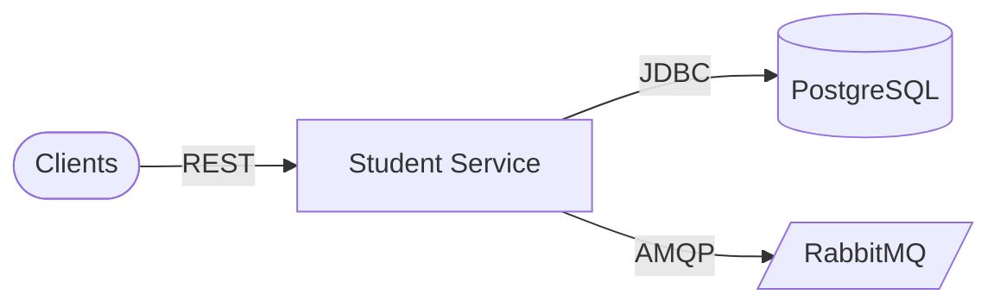

# Architecture

## Clients

Admin portals, enrollment, grading, and other services.

### Components

- Internal REST clients
- Future BFF / gateway

### Responsibilities

- Read and mutate student records within auth policy

### Technologies

- HTTPS
- JWT when enforced

## Application runtime

Student Service Spring Boot application.

### Components

- StudentCommandController
- StudentQueryController
- Services and JPA repositories

### Responsibilities

- Student aggregate for the Architecture College platform

### Technologies

- Spring Web
- Spring Data JPA
- Spring AMQP

## Data & messaging

Persistence plus broker.

### Components

- PostgreSQL student_db
- RabbitMQ
- Eureka + Config Server clients

### Responsibilities

- Durable students; publish consumption-friendly signals

### Technologies

- PostgreSQL 16
- RabbitMQ 3
- Spring Cloud Netflix Eureka
- Spring Cloud Config

## Design patterns

| Pattern | Category | Description |
| --- | --- | --- |
| DB Database per service | Microservices | student_db is owned only by this service. |
| CQRS CQRS-style HTTP split | API | Separate controllers for commands and queries. |

## Scalability strategies

- **Scale stateless replicas** — Horizontal scaling behind load balancer.
- **Tune broker consumers** — Prefetch and listener concurrency for peak registration periods.

## Security strategies

- **Authenticated mutations** — Align write routes with Spring Security and gateway policies.
- **PII handling** — Student data — minimize logging; encrypt at rest where required.

## Cache strategies

| Name | TTL | Coverage | Description |
| --- | --- | --- | --- |
| Optional read cache | TBD | Future | Cache filter-heavy GET /by responses if profiling demands it. |

## Architecture highlights

### EU Discovery + config

Eureka + config-data/student-service.yml.

### MQ AMQP integration

Spring AMQP for cross-service workflows.

## Architecture diagram

### Legend

| Type | Label |
| --- | --- |
| service | Service |
| database | PostgreSQL |
| queue | RabbitMQ |

### Nodes

| ID | Label | Type | Status |
| --- | --- | --- | --- |
| client | Clients | client | healthy |
| student | Student Service | service | healthy |
| pg | PostgreSQL | database | healthy |
| mq | RabbitMQ | queue | healthy |

### Connections

| From | To | Label | Protocol |
| --- | --- | --- | --- |
| client | student | REST | HTTP |
| student | pg | JDBC | TCP |
| student | mq | AMQP | TCP |

### Mermaid overview

## Data flow

### Request flow

1. **REST call** — Clients hit /v1/api/students for reads or writes.
2. **Business rules** — Validation, professional line rules, semester increments.
3. **Persist and notify** — JPA commit; optional message publish to Rabbit.

### Event flow

1. **Emit** — Student lifecycle events on Rabbit (as wired).
2. **Consume** — Peers refresh projections or trigger workflows.

## Technical decisions

### Command/query controllers

**Problem:** Write models differ from read traffic patterns.

**Solution:** StudentCommandController vs StudentQueryController.

**Outcome:** Clearer evolution of validation and query optimization.

#### Alternatives considered

- Single controller class
- GraphQL student API

## Additional notes

# Architecture

Matches **`ProjectArchitectureModel`** in `docs-schema.ts`.

## Watch items

- **Idempotency** on progression endpoints if retried by clients.  
- **Rabbit** topology and dead-letter strategy for failed consumers.  
- **ddl-auto** vs migrations outside dev.

