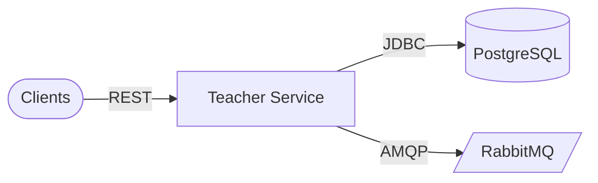

# Architecture

## Clients

Schedule, grade, admin, and account-aligned callers.

### Components

- Internal microservices
- Authenticated gateways

### Responsibilities

- Manage faculty with JWT-protected routes

### Technologies

- HTTPS
- JWT Bearer

## Application runtime

Teacher Service Spring Boot application.

### Components

- TeacherCommandController
- TeacherQueryController
- Security configuration
- JPA repositories

### Responsibilities

- Teacher aggregate backing scheduling and grading

### Technologies

- Spring Web
- Spring Data JPA
- Spring Security
- Spring AMQP

## Data & messaging

Relational store and broker.

### Components

- PostgreSQL teacher_db
- RabbitMQ
- Eureka + Config Server clients

### Responsibilities

- Persist teachers; integration events

### Technologies

- PostgreSQL 16
- RabbitMQ 3
- Spring Cloud Netflix Eureka
- Spring Cloud Config

## Design patterns

| Pattern | Category | Description |
| --- | --- | --- |
| DB Database per service | Microservices | teacher_db owned solely by this service. |
| GW Strangler path normalization | Integration | Gateway maps legacy /teachers reads to versioned public paths. |

## Scalability strategies

- **Stateless API replicas** — Scale JVMs; no session stickiness required.
- **Rabbit consumer tuning** — Scale listeners or partition workloads by routing key if needed.

## Security strategies

- **Shared JWT signing key** — Must match account-service secret; never commit production values.
- **Least privilege DB credentials** — teacher_db role only.

## Cache strategies

| Name | TTL | Coverage | Description |
| --- | --- | --- | --- |
| None default | TBD | Future | Optional cache for validate-account hot path. |

## Architecture highlights

### EU Discovery + config

Eureka + config-data/teacher-service.yml.

### MQ AMQP

Integration with peer services.

## Architecture diagram

### Legend

| Type | Label |
| --- | --- |
| service | Service |
| database | PostgreSQL |
| queue | RabbitMQ |

### Nodes

| ID | Label | Type | Status |
| --- | --- | --- | --- |
| client | Clients | client | healthy |
| teacher | Teacher Service | service | healthy |
| pg | PostgreSQL | database | healthy |
| mq | RabbitMQ | queue | healthy |

### Connections

| From | To | Label | Protocol |
| --- | --- | --- | --- |
| client | teacher | REST | HTTP |
| teacher | pg | JDBC | TCP |
| teacher | mq | AMQP | TCP |

### Mermaid overview

## Data flow

### Request flow

1. **Authenticate** — JWT validated for protected routes.
2. **Invoke teacher API** — Commands /v1/api/teachers or queries /teachers.
3. **Persist / integrate** — JPA to teacher_db; optional AMQP publish.

### Event flow

1. **Teacher lifecycle signal** — Messages on create/delete or other events (per wiring).
2. **Downstream reaction** — Schedule/grade adjust projections.

## Technical decisions

### Split command and query base paths

**Problem:** Legacy read API used /teachers without version prefix.

**Solution:** TeacherCommandController under /v1/api/teachers; TeacherQueryController under /teachers.

**Outcome:** Backward compatibility internally; gateway should unify externally.

#### Alternatives considered

- Refactor query controller to /v1/api/teachers (breaking change)
- Single controller with explicit versioning headers

## Additional notes

# Architecture

Matches **`ProjectArchitectureModel`** in `docs-schema.ts`.

## Watch items

- **Unify public paths** for Swagger and clients (`/v1/api/teachers` recommended).  
- **JWT key drift** between account-service and teacher-service causes **intermittent 401s**.  
- **Rabbit** topology as code; monitor DLQs.

